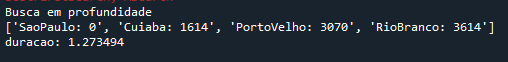
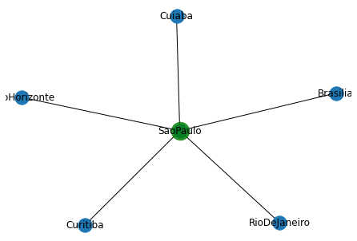
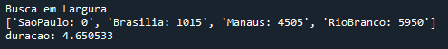
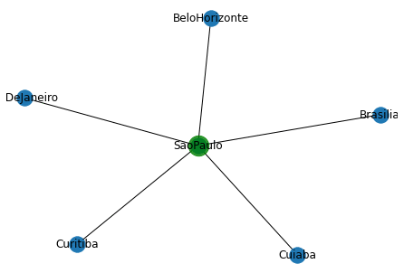
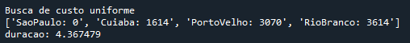
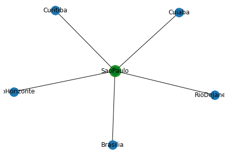
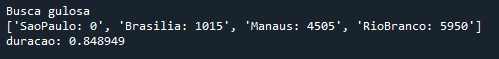
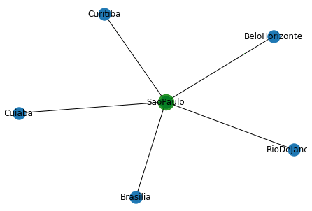
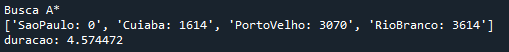
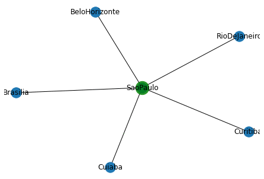

# Estrategias de busca


## Este foi um projeto desenvolvido a fim de resolver um problema clássico em estrategias de busca, traçar rotas entre cidades. Exercitando vario conceitos afim de encontra o melhor caminho entre duas capitais brasileiras.


## Como instalar

* Links para dowload do python
[Anaconda](https://www.python.org/downloads/)
[Python](https://www.anaconda.com/products/individual)

* As bibliotecas Necessárias para rodar o projeto

```
1. pip install python-igraph
2. pip install matplotlib
```

* Como rodar

```
1. git clone git@github.com:HendricksSumeck/EstrategiasDeBusca.git
2. cd EstrategiasDeBusca
3. python start
```


## Aplicativo rodando
### Considerando o cenario de sair de São Paulo com chegada a Rio Branco no Acre

###**Busca em profundidade**


###**Busca em largura**


###**Busca de custo uniforme**


###**Busca gulosa**


###**Busca A**




## Mantenha contato

Hendrick Sumeck
* [hsumeck@gmail.com](mailto:hsumeck@gmail.com)
* [github.com/HendricksSumeck](http://github.com/HendricksSumeck)
* [linkedin.com/in/hendrick-sumeck](https://www.linkedin.com/in/hendrick-sumeck-45a41918a/)


## Referencias dos algoritmos
[Busca em profundidade](https://www.annytab.com/depth-first-search-algorithm-in-python/)
[Busca em Largura](https://www.annytab.com/breadth-first-search-algorithm-in-python/)
[Busca de custo uniforme](https://www.annytab.com/dijkstras-search-algorithm-in-python/)
[Busca gulosa](https://www.annytab.com/best-first-search-algorithm-in-python/)
[Busca A](https://www.annytab.com/a-star-search-algorithm-in-python/)